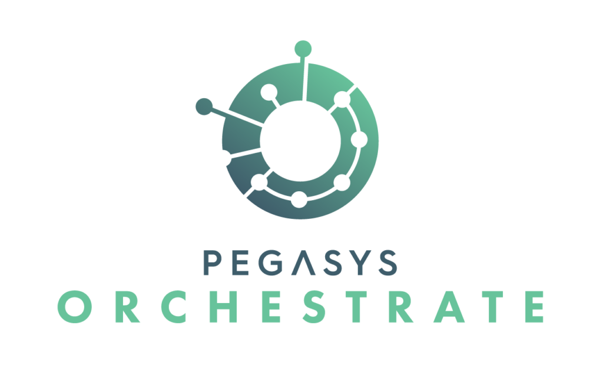

PegaSys Orchestrate is a platform that enables enterprises to easily build secure and reliable applications on Ethereum blockchains.

It provides extensive features to connect to blockchain networks:

- Transaction management (transaction crafting, gas management, nonce management, transaction listening...)
- Account management with private key storage in Hashicorp Vault
- Smart Contract Registry
- Multi-chain & Multi-protocol (public or private)

For more information please refer to [PegaSys Orchestrate Official Documentation](https://docs.orchestrate.pegasys.tech/).

# Orchestrate-Kubernetes

- [Orchestrate-Kubernetes](#Orchestrate-Kubernetes)
  - [Prerequisites](#Prerequisites)
    - [Deployment](#Deployment)
    - [Only if using Hashicorp Vault on AWS](#Only-if-using-Hashicorp-Vault-on-AWS)
    - [Credentials](#Credentials)
  - [Configure Orchestrate](#Configure-Orchestrate)
    - [Configure access](#Configure-access)
    - [General configuration](#General-configuration)
      - [Only when using Hashicorp Vault in AWS](#Only-when-using-Hashicorp-Vault-in-AWS)
      - [Configure multi-tenancy](#Configure-multi-tenancy)
  - [Set-up Orchestrate](#Set-up-Orchestrate)
    - [Only if you are using Helm version 2, Set-up tiller](#Only-if-you-are-using-Helm-version-2-Set-up-tiller)
  - [Deploy Orchestrate](#Deploy-Orchestrate)

This repository contains an implementation example on how to deploy Orchestrate and its dependencies using Kubernetes, Helm charts and Helm files.
This is intended to to help the understanding on how to run and configure Orchestrate using Kubernetes.

## Prerequisites

### Deployment

- [Kubernetes](https://kubernetes.io/) version 1.12 or upper;
- [Helm](https://helm.sh/) version 2 or upper;
- [Helmfile](https://github.com/roboll/helmfile);
- [Helm diff plugin](https://github.com/databus23/helm-diff).

### Only if using Hashicorp Vault on AWS

- [Amazon DynamoDB](https://aws.amazon.com/dynamodb/);
- [AWS Key Management Service (KMS)](https://aws.amazon.com/kms/);
- [AWS Secrets Manager](aws.amazon.com/secrets-manager);
- [AWS Identity and Access Management (IAM)](https://aws.amazon.com/iam/).

### Credentials

- Credentials to pull Orchestrate's Docker images;
- Credentials to pull Orchestrate's Helm charts.

!!! Note
  If you do not have them yet, please contact [support@pegasys.tech](support@pegasys.tech)

## Configure Orchestrate

### Configure access

Set the following parameters:
On the file [`values/tags.yaml`](./values/tags.yaml) set your Docker images' credentials:

- `registry.credentials.username`
- `registry.credentials.password`

On the file [`helmfile-common.yaml`](./helmfile-common.yaml) set your Helm Registry' credentials:

- `repositories.username`
- `repositories.password`

### General configuration

1. Make a copy of the file ['environments/template-placeholder.yaml'](./environments/template-placeholder.yaml);

2. Rename the file to '<KubernetesNameSpace>.yaml';
   !!! Note:
    Keep the name of the file and of the Kubernetes namespace in mind, as you will need them to set up Orchestrate.

3. Save the file on the 'environments' directory.

4. Declare the blockchain networks you want to connect Orchestrate to, separate them by an space.

```
chainRegistry:
  init:'{"name":"<ChainName1>","tenantID":"<tenatID1>", "urls":["<list item 1A>","<list item 1B>"]} {"name":"<ChainName2>","tenantID":"<tenatID2>", "urls":["<list item 2A>","<list item 2B>"]}}'
```

#### Only when using Hashicorp Vault in AWS

- `IAMRole`: Amazon Resource Names (ARN) of AWS IAM role (string).
- `Region`: AWS Region in which resources are created (string).
- `KMSKeyId`: AWS KMS key ID to use for encryption and decryption (string).
- `SecretId`: AWS Secret manager's alias or name where the root token is stored (string).

#### Configure multi-tenancy

- `multitenancy.enabled`: Enables this Orchestrate feature (default: false).
- `AUTH_JWT_CLAIMS_NAMESPACE`: Tenant namespace to retrieve tenantID in OpenId or Access Token (JWT) (default: "http://tenant.info/"). You will find this information on your identity provider.
- `authentication.AUTH_JWT_CERTIFICATE`: Certificate of authentication service **encoded in base64**. You will find the information in your identity provider.
- `authentication.AUTH_API_KEY`: This key is used for authentication internally on Orchestrate, we highly recommend to use a UUID format.

  !!! example
    The  file [`environments/orchestrate-demo.yaml`](./environments/orchestrate-demo.yaml) is a configuration example for a deployment using HashiCorp Vault on AWs.

## Set-up Orchestrate

Set the variable  `TARGET_NAMESPACE` to the Kubernetes namespace where you will deploy Orchestrate, this was used on [General configuration's point 2](#general-configuration), for doing so:

1. If you do not have the Kubernetes namespace yes, please create it:

```bash
kubectl create namespace $TARGET_NAMESPACE
```

2. Initialize the variable:

```bash
export TARGET_NAMESPACE=<KUBERNETES_NAMESPACE>
```

### Only if you are using Helm version 2, Set-up tiller

1. Apply Role Base Access Control to tiller:

```bash
cat tiller.yaml | envsubst | kubectl apply -f -
```

2. Deploy tiller:

```bash
helm init --tiller-namespace $TARGET_NAMESPACE --upgrade --override 'spec.template.spec.containers[0].command'='{/tiller,--storage=secret}' --service-account tiller --wait
```

## Deploy Orchestrate

To deploy Orchestrate and its dependencies run the following command:

```bash
helmfile -f helmfile.yaml -e $TARGET_NAMESPACE apply --suppress-secrets
```

!!!hint
  to delete Orchestrate's deployment run the following command:

  ```bash
  helmfile -f helmfile.yaml -e $TARGET_NAMESPACE delete --purge
  ```
