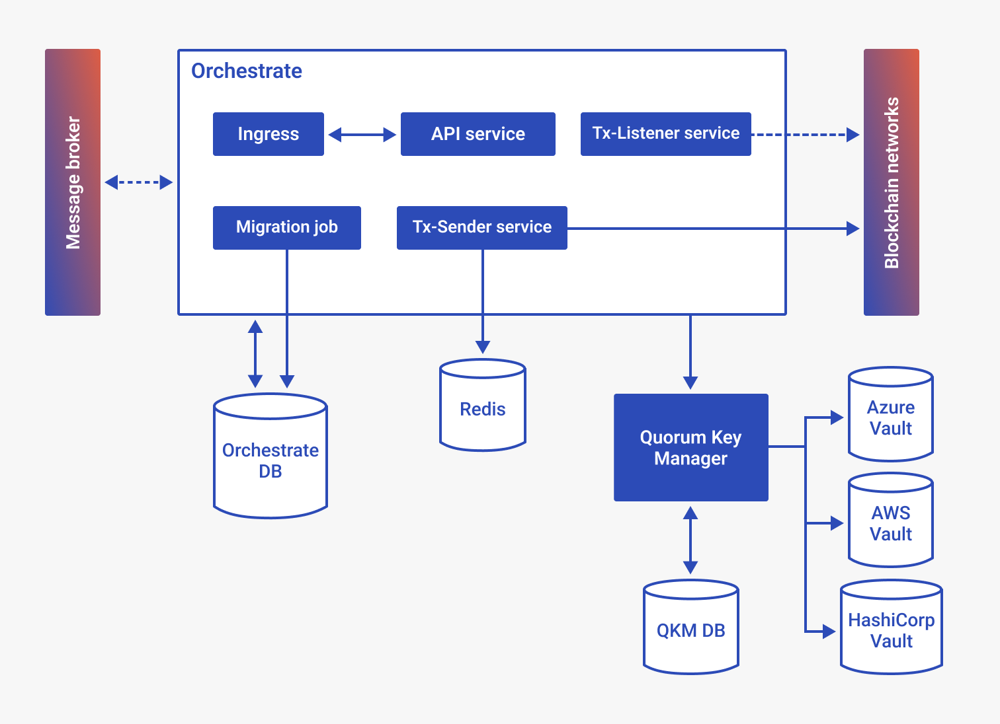

# Codefi Orchestrate

[Orchestrate](https://codefi.consensys.net) is a platform that enables enterprises to easily build
secure and reliable applications on Ethereum blockchains.

It provides extensive features to connect to blockchain networks:

- Transaction management (transaction crafting, gas management, nonce management, transaction listening)
- Account management with private key storage in Hashicorp Vault
- Smart Contract Registry
- Multi-chain & Multi-protocol (public or private)

For more information, refer to the [Orchestrate documentation](https://docs.orchestrate.consensys.net/).

<H1>Orchestrate-Kubernetes</H1>

- [Codefi Orchestrate](#codefi-orchestrate)
- [Deployment overview](#overview)
- [Compatibility](#compatibility)
- [1. Requirements](#1-requirements)
  - [1.1. CLI tools](#11-cli-tools)
- [2. Installing Orchestrate](#2-installing-orchestrate)
  - [2.1. Quickstart](#21-quickstart)
  - [2.2. Delete Orchestrate](#22-delete-orchestrate)
  - [2.3. Advanced configuration](#23-advanced-configuration)
- [3. Hashicorp Vault](#3-hashicorp-vault)
- [4. Upgrading](#5-upgrading)
  - [4.1. From Orchestrate v2.5.X to v21.1.X](#41-from-orchestrate-v25x-to-v211x)
  - [4.2. From Orchestrate v2.1.X to v21.12.X](#42-from-orchestrate-v211x-to-v2112x)

This repository contains an implementation example on how to deploy Orchestrate and an optional Vault server using Kubernetes and Helm charts.

This chart used to help deploy Orchestrate dependencies :

- Kafka
- Postgres
- Redis
- Quorum-key-manager
- Vault-operator

It is now your responsibility to deploy all these separately.
You will find relevant information related to these deployments or managed solutions via your prefered cloud provider platforms.

For Vault-operator it is mandatory to rely on https://github.com/banzaicloud/bank-vaults/tree/master/charts/vault-operator

# Overview

Below is a high level diagram of what this chart will help you deploy





# Compatibility

| Orchestrate-kubernetes versions | Orchestrate versions          |
|---------------------------------|-------------------------------|
| master/HEAD                     | Orchestrate v21.12.x or higher |
| v7.0.0                          | Orchestrate v21.12.x or higher |
| v6.0.0                          | Orchestrate v21.12.x or higher |
| v5.0.0                          | Orchestrate v21.1.x or higher |
| v4.0.0                          | Orchestrate v2.5.x            |
| v3.1.0                          | Orchestrate v2.5.x            |
| v3.0.0                          | Orchestrate v2.4.x            |

# 1. Requirements

## 1.1. CLI tools

- [Kubernetes](https://kubernetes.io/) version 1.19 or upper;
- [Helm](https://helm.sh/) version 3 or upper;
- [Helmfile](https://github.com/roboll/helmfile);
- [Helm diff plugin](https://github.com/databus23/helm-diff).

# 2. Installing Orchestrate

## 2.1. Quickstart

1. To deploy a simple Orchestrate (not production ready), run the following command:

```bash
helmfile apply --suppress-secrets
```

2. Once deployed you could easily test Orchestrate API in http://localhost:8081:

```
kubectl port-forward --namespace orchestrate svc/orchestrate-api 8081:8081
```

[See Orchestrate APIs documentation](https://consensys.gitlab.io/client/fr/core-stack/orchestrate/latest/)

## 2.2. Delete Orchestrate
!!!hint
  to delete Orchestrate's deployment and its ressources run the following commands:

```bash
helmfile delete --purge
kubectl delete namespace orchestrate
```

## 2.3. Advanced configuration

This repository provides few examples of environment values sets:
- `environments/default.yaml`: default value set when executing `helmfile apply`
  - Deploy a light one-replica of Orchestrate services
  - One partition per Kafka topic 
- `environments/qa.yaml`: `helmfile -e qa apply`
  - Deploy a Orchestrate services with multitenancy
- `environments/staging.yaml`: `helmfile -e staging apply`
  - Deploy a 3-replica of Orchestrate services with multitenancy distributed accros Availability-Zones

Note: All the passwords and usernames of every dependency are located in `environments/common.yaml.gotmpl`. Do not forget to change,  extract, those values depending on your needs / environment.

The following tables lists the configurable values for the environments. Some of them are directly configurable via environement variable:

| Parameter                                      | Description                                                                | Default                                                     |
|------------------------------------------------|----------------------------------------------------------------------------|-------------------------------------------------------------|
| `orchestrate.namespace`                        | Namespace where Orchestrate will be deployed (env `ORCHESTRATE_NAMESPACE`) | `orchestrate`                                               |
| `orchestrate.chart.name`                        | This deployment orchestrate chart (env `ORCHESTRATE_CHART`) | `consensys/orchestrate`                                               |
| `orchestrate.chart.version`                        | Namespace where Orchestrate will be deployed (env `ORCHESTRATE_CHART_VERSION`) | `1.0.6`                                               |
| `orchestrate.global.imageCredentials.registry` | Docker registry where Orchestrate images are stored (env `REGISTRY_URL`)   | `docker.consensys.net`                                      |
| `orchestrate.global.imageCredentials.username` | [REQUIRED] Username of the registry (env `REGISTRY_USERNAME`)              |                                                             |
| `orchestrate.global.imageCredentials.password` | [REQUIRED] Password of the registry (env `REGISTRY_PASSWORD`)              |                                                             |
| `orchestrate.global.image.repository`          | Path to Orchestrate image (env `ORCHESTRATE_REPOSITORY`)                   | `docker.consensys.net/priv/orchestrate` |
| `orchestrate.global.image.tag`                 | Orchestrate image tag (env `ORCHESTRATE_TAG`)                              | `v21.1.2`                                                   |
| `orchestrate.api`                              | Orchestrate API values                                                     |                                                             |
| `orchestrate.qkm`                       | Orchestrate Key Manager values, for usage with version 21.10.X and above                                            |                                                             |
| `orchestrate.txListener`                       | Orchestrate Tx Listener values                                             | `nil`                                                       |
| `orchestrate.txSender`                         | Orchestrate Tx Sender values                                               | `nil`                                                       |
| `orchestrate.test.image.repository`            | Path to Orchestrate test image (env `TEST_REPOSITORY`)                     | `nil`                                                       |
| `orchestrate.test.image.tag`                   | Orchestrate test image tag (env `TEST_TAG`)                                | `nil`                                                       |

For more information about values defined in values/orchestrate.yaml.gotmpl, please see https://github.com/ConsenSys/orchestrate-helm

| Parameter             | Description                                                                        | Default                                                            |
|-----------------------|------------------------------------------------------------------------------------|--------------------------------------------------------------------|
| `vault.namespace`     | Namespace where Hashicop Vault will be deployed (env `VAULT_NAMESPACE`)            | `orchestrate`                                                      |
| `vault.replicaCount`  | Number of Vault instance                                                           | `1`                                                                |
| `vault.plugin.tag`    | Orchestrate Hashicorp Vault Plugin tag (env `VAULT_PLUGIN_TAG`)                    | `v1.1.3`                                                           |
| `vault.plugin.sha256` | Orchestrate Hashicorp Vault Plugin SHA256 checksum  (env `VAULT_PLUGIN_SHA256SUM`) | `e084800c61749a9c7b51f6e91bb89ab6d5a2678cdb707eaa73f9bef0cf73fc61` |

For more information about values defined in values/vault.yaml.gotmpl, please see https://github.com/banzaicloud/bank-vaults/tree/master/operator/deploy and https://github.com/banzaicloud/bank-vaults/tree/master/charts/vault


| Parameter    | Description                                                                                                                                                                                                                                                                                                        | Default |
|--------------|--------------------------------------------------------------------------------------------------------------------------------------------------------------------------------------------------------------------------------------------------------------------------------------------------------------------|---------|
| `domainName` | (Option) Domain name registered to the ingress controller of your kubernetes cluster. If not empty Orchestrate API will be exposed to {{orchestrate.namespace}}.{{domainName}}. If the observability stack is enabled grafana.{{domainName}} and prometheus.{{domainName}} will be exposed too (env `DOMAIN_NAME`) | ``      |


Values below are useful when deploying orchestrate with version 21.10.X, having possibly a Quorum Key Manager running independently

| Parameter                  | Description                                                           | Default       |
|----------------------------|-----------------------------------------------------------------------|---------------|
| `qkm.enabled`              | If true, Quorum Key Manager will be deployed                          | `true`        |
| `qkm.url`                  | Url where Quorum Key Manager may be reached (env `QKM_URL`)           | `http://quorumkeymanager.orchestrate` |
| `qkm.namespace`            | Namespace where Quorum Key Manager is deployed (env `QKM_NAMESPACE`)  | `orchestrate` |
| `qkm.orchestrate.storeName`| Initial and existing eth-account name used by orchestrate             | `eth-accounts` |
| `qkm.orchestrate.apiKey`   | Existing apiKey used by orchestrate to authenticate                   | `YWRtaW4tdXNlcg==` |

For more information about values defined in values/qkm.yaml.gotmpl, please refer to https://github.com/ConsenSys/quorum-key-manager-helm

# 3. Hashicorp Vault

This helmfiles optionally deploys [Hashicorp's Vault](https://www.vaultproject.io/) with integrated storage with raft with [Bank-Vaults](https://github.com/banzaicloud/bank-vaults). We deploy first the Vault operator, then the following ressources contained in `values/vault.yaml`:
- Vault CRD's, including [Vault policy](https://www.vaultproject.io/docs/concepts/policies), [Vault authentication](https://www.vaultproject.io/docs/concepts/auth), and [Orchestrate Hashicorp Vault Plugin](https://github.com/ConsenSys/orchestrate-hashicorp-vault-plugin)

[Vault policy](https://www.vaultproject.io/docs/concepts/policies)
```yaml
  externalConfig:
    policies:
        {{ if .Values.observability.enabled }}
        - name: prometheus
          rules: path "sys/metrics" {
            capabilities = ["list", "read"]
            }
        {{ end }}
      - name: orchestrate_key_manager
        rules: path "orchestrate/*" {
          capabilities = ["create", "read", "update", "list"]
          }
```

[Vault authentication](https://www.vaultproject.io/docs/concepts/auth)
```yaml
  externalConfig:
    auth:
      - type: kubernetes
        roles:
          - name: orchestrate-key-manager
            bound_service_account_names: ["orchestrate-key-manager", "vault-secrets-webhook", "vault"]
            bound_service_account_namespaces: ["{{ .Values.vault.namespace }}", "{{ .Values.orchestrate.namespace }}"]
            policies: orchestrate_key_manager
      {{ if .Values.observability.enabled }}
      - type: kubernetes
        roles:
          - name: prometheus
            bound_service_account_names: prometheus
            bound_service_account_namespaces: {{ .Values.observability.namespace }}
            policies: prometheus
      {{ end }}
```
- PVCs
- Service Account
- RBAC configuration

Note that it is highly recommended to use the `consensys/quorum-hashicorp-vault-plugin` image when deplying a Vault ressource.


# 4. Upgrading

## 4.1. From Orchestrate v2.5.X to v21.1.X

[Read the steps to upgrade Orchestrate v2.5.X to v21.1.X](docs/upgrades/v21-1-X.md)

## 4.2. From Orchestrate v21.1.X to v21.12.X

[Read the steps to upgrade Orchestrate v21.1.X to v21.12.X](docs/upgrades/v21-12-X.md)

